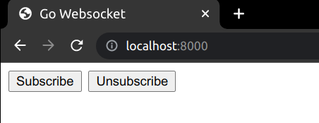
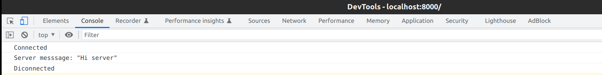

# PubSubServer

This PubSubServer project is an HTTP+WebSockets server that implements an in-memory, realtime PubSub system and utilizes [Gorilla](https://github.com/gorilla/websocket) project to upgrade the HTTP server connection to the WebSocket protocol etc.

**note**: As per project requirement subscription topics, high availability, or persistence are not implemented.

## Structure
The frontend is contained in index.html. It has 2 buttons to `Subscribe` and `Unsubscribe` the websocket connection.

<p align="center">
  
</p>

The messages are received via the WebSocket `/subscribe` endpoint and published via
the HTTP POST `/publish` endpoint. The reason for not publishing messages over the WebSocket is so that you can easily publish a message with curl.

The server portion is main.go and pubsub.go and implements serving the static frontend assets, the /subscribe WebSocket endpoint and the HTTP POST /publish endpoint.

You can see the `Connected` console message when clicked on `Subscribe` button and `Disconnected` console message when clicked on `Unsubscribe` button or a "Server message" when a publish message is received.

**note**: As subscription topics are not implemented, published message will be sent to all the subscribers.

<p align="center">
  
</p>

Message struct looks like:

```go
type message struct {
	Action  string `json:"action"`
	Message string `json:"message"`
}
```

Allowed actions are:
- Publish to "publish" forex. `{"action":"publish", "message": "Hi server"}`
- Subscribe to "subscribe".
- Unsubscribe to "unsubscribe".
